```{r xaringan-tile-view, echo=FALSE}
xaringanExtra::use_tile_view()
```

### Land acknowledgment

* This work was started while at URegina, which is on Treaty 4 lands

### Funding

.row[

.col-6[
.center[]
]

.col-6[
.center[]
]

]

### Data

.row[

.col-8[

* Lake ice data from [Global Lake and River Ice Phenology Database](http://nsidc.org/data/G01377.html)
* Lake ice study joint work with Stefano Mezzini

* [bit.ly/water-talk-2024](https://bit.ly/water-talk-2024)

]

.col-4[

.center[

```{r, fig.align = "center", out.width="90%", echo=FALSE}

```
]

]

]

<!-- ### Slides

* HTML Slide deck [bit.ly/water-talk-2024](http://bit.ly/water-talk-2024) &copy; Simpson & Mezzini (2024) [](http://creativecommons.org/licenses/by/4.0/) -->

???

This research was conducted while Stefano and I were at the University of Regina, which is situated on the territories of the nay-hi-yuh-wuk (Cree; nêhiyawak), uh-nish-i-naa-payk (Salteaux; Anihšināpēk), Dakota, Lakota, and Nakoda, and is the homeland of the Métis/Michif Nation.

```{r setup, include=FALSE, cache=FALSE}
options(htmltools.dir.version = FALSE)
knitr::opts_chunk$set(cache = TRUE, dev = 'svg', echo = FALSE, message = FALSE, warning = FALSE,
                      fig.height=6, fig.width = 1.777777*6)

library("curl")
library("ggplot2")
library("dplyr")
library("tibble")
library('tidyr')
library('mgcv')
library('forcats')
library('mvnfast')
library('purrr')
library('gganimate')
library('gratia')
library('readr')
library("patchwork")
theme_set(theme_minimal(base_size = 14, base_family = 'Fira Sans'))
library('readxl')
library('here')

## constats
anim_width <- 1000
anim_height <- anim_width / 1.77777777
anim_dev <- 'png'
anim_res <- 200
```

---

# Lake Suwa ice record

<br />

.row[

.col-8[

```{r}
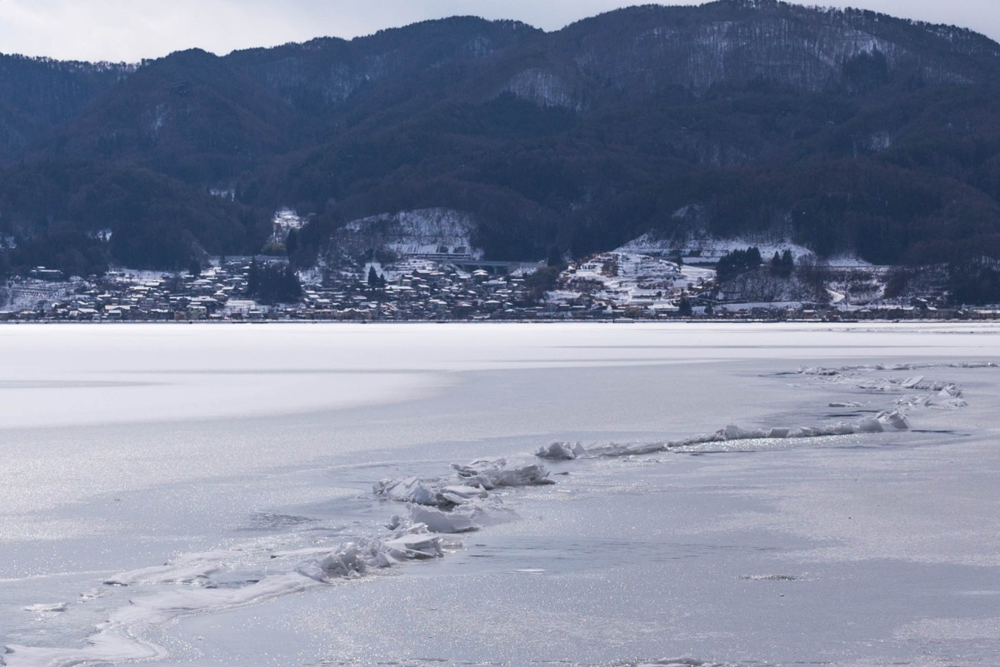
```
.smaller[
    Source: [Wikipedia, Kzu06, CC-BY-SA](https://commons.wikimedia.org/wiki/File:180205_Lake_Suwa_omiwatari_01.jpg)
]

]

.col-4[

```{r}
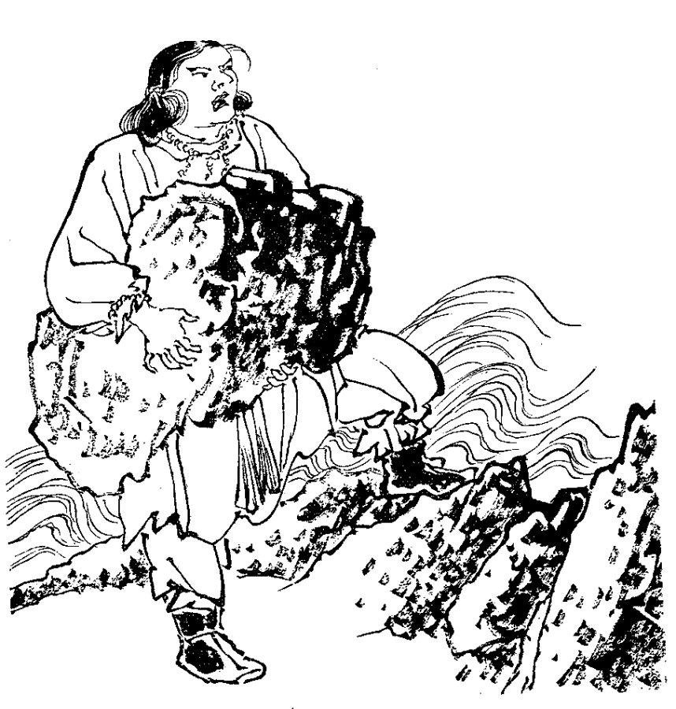
```

.smaller[
    Source: [Wikipedia, Hagino Yoshiyuki, PD](https://commons.wikimedia.org/wiki/File:%E5%BB%BA%E5%BE%A1%E5%90%8D%E6%96%B9%E7%A5%9E_-_Takeminakata.jpg)
]

]

]

???

The ice record at Lake Suwa, Nagano Prefecture, Japan, is the oldest known human-observed climate record in the world, ice formation dates from 1443

Omiwatari or ice ridges form on the lake as pressure ridges that arise due to vertical thermal gradients in the lake

Local Shinto tradition holds that the Omiwatari &mdash; or God's Crossing &mdash; are formed by God's crossing Lake Suwa to move between the buildings of the Suwa Grand Shrine

Folklore has it that the Omiwatari are formed when the Guardian God of Suwa, Takeminakata-no-kami, leaves his sanctuary and crosses the Lake Suwa to visit his wife, the goddess Yasakotame

---

# Lake ice records

.row[

.col-7[

* Collected for *economical*, *recreational*, & *religious* purposes
* Support a range of activities
    * Winter transportation
    * Fishing
    * Social activities
    * Spiritual ceremonies
* Excellent climate indicators
* Lake ice cover is key control on many lake processes

]

.col-5[

```{r}
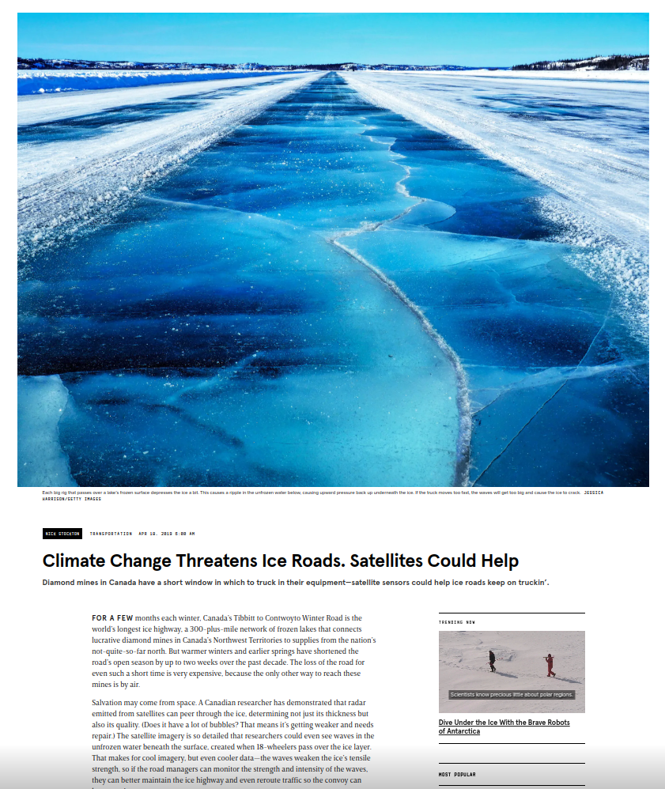
```

.smaller[
    Source: [Wired, 2019](https://www.wired.com/story/climate-change-threatens-ice-roads-satellites-could-help/)
]

]

]

???

Such records have been collected globally, principally in the Northern hemisphere, for decades to centuries for a host of economical, recreational, and religious reasons

This is because lake and river ice supports a wide range of activities

Lake ice is very sensitive to changes in climate (esp. temperature) and as such they are excellent indicators of climate change

---

# Trends in lake ice phenology

Magnuson *et al* (2000) &mdash; seminal study of trends in lake ice phenology

Confirmed by multiple follow-up studies

Long-term records of lake ice phenology demonstrated that many Northern Hemisphere lakes experienced earlier ice breakup, later ice freeze-up, and shorter ice duration within a warming world

<br />

[Magnuson *et al* (2000) Science 289, 1743–1746](https://doi.org/10.1126/science.289.5485.1743)

???

Magnuson et al. (2000) observed long-term changes in lake ice cover in 20 spatially and morphologically heterogeneous lakes from 1855 to 1995. These long-term records of lake ice phenology demonstrated that many Northern Hemisphere lakes experienced earlier ice breakup, later ice freeze-up, and shorter ice duration within a warming world

---

# Global Lake and River Ice Phenology

.center[
```{r include-map-figure, out.width = 550, out.height = 550}
knitr::include_graphics("resources/animated-map.gif")
```
]

???

Global Lake and River Ice Phenology Database

We worked with 568 lakes & 628 observational records with data post 1950

---

# Problems

.row[

.col-6[

* time to ice-on or ice-off positive, continuous, skewed, can be _censored_

* linear trends to estimate shifts in phenology

* interest has turned to asking whether rates of change in lake ice phenology have changed
]

.col-6[
.center[
```{r include-dates-figure, out.width = 550, out.height = 550}
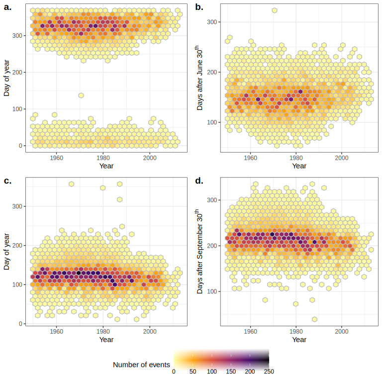
```
]
]
]

???

Original analyses grappled with the problem that the day of year of freezing spanned the start/end of the calendar year

A solution is to turn the data into time (days) to event (freezing)

Such data are necessarily positive, continuous, and skewed, and can be _censored_

Additionally, trends have been represented as linear models, which while perhaps OK for shorter time series are not useful for capturing the non-linear trends typically present in longer records or for asking more nuanced questions as to whether rates of change in ice loss are themselves changing

---

# Time-to-event &mdash; Event history models

Follow-up times `->` Survival analysis model

Piece-wise exponential model is essentially a Poisson GLM on transformed data

Piece-wise exponential additive mixed model &mdash; PAMM

*pammtools* 📦 (Bender, Groll, Scheipl, 2018 *Statistical Modelling*)


???

hazard rate is piece-wise constant within time intervals but we estimate it semi-parametrically

---

# PAMMs &mdash; Lake Mendota

.center[
```{r include-mendota-figure}
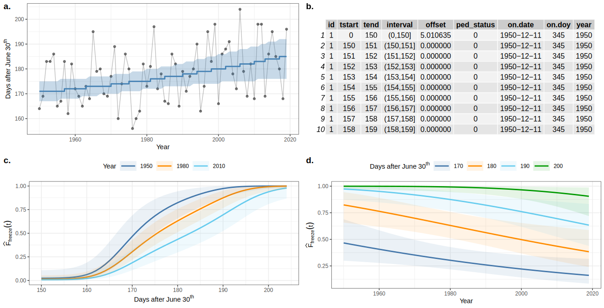
```
]

```{r smooth-fun-animation, results = FALSE}
f <- function(x) {
    x^11 * (10 * (1 - x))^6 + ((10 * (10 * x)^3) * (1 - x)^10)
}

draw_beta <- function(n, k, mu = 1, sigma = 1) {
    rmvn(n = n, mu = rep(mu, k), sigma = diag(rep(sigma, k)))
}

weight_basis <- function(bf, x, n = 1, k, ...) {
    beta <- draw_beta(n = n, k = k, ...)
    out <- sweep(bf, 2L, beta, '*')
    colnames(out) <- paste0('f', seq_along(beta))
    out <- as_tibble(out)
    out <- add_column(out, x = x)
    out <- pivot_longer(out, -x, names_to = 'bf', values_to = 'y')
    out
}

random_bases <- function(bf, x, draws = 10, k, ...) {
    out <- rerun(draws, weight_basis(bf, x = x, k = k, ...))
    out <- bind_rows(out)
    out <- add_column(out, draw = rep(seq_len(draws), each = length(x) * k),
                      .before = 1L)
    class(out) <- c("random_bases", class(out))
    out
}

plot.random_bases <- function(x, facet = FALSE) {
    plt <- ggplot(x, aes(x = x, y = y, colour = bf)) +
        geom_line(lwd = 1, alpha = 0.75) +
        guides(colour = FALSE)
    if (facet) {
        plt + facet_wrap(~ draw)
    }
    plt
}

normalize <- function(x) {
    rx <- range(x)
    z <- (x - rx[1]) / (rx[2] - rx[1])
    z
}

set.seed(1)
N <- 500
data <- tibble(x     = runif(N),
               ytrue = f(x),
               ycent = ytrue - mean(ytrue),
               yobs  = ycent + rnorm(N, sd = 0.5))

k <- 10
knots <- with(data, list(x = seq(min(x), max(x), length = k)))
sm <- smoothCon(s(x, k = k, bs = "cr"), data = data, knots = knots)[[1]]$X
colnames(sm) <- levs <- paste0("f", seq_len(k))
basis <- pivot_longer(cbind(sm, data), -(x:yobs), names_to = 'bf')
basis

set.seed(2)
bfuns <- random_bases(sm, data$x, draws = 20, k = k)

smooth <- bfuns %>%
    group_by(draw, x) %>%
    summarise(spline = sum(y)) %>%
    ungroup()

p1 <- ggplot(smooth) +
    geom_line(data = smooth, aes(x = x, y = spline), lwd = 1.5) +
    labs(y = 'f(x)', x = 'x') +
    theme_minimal(base_size = 16, base_family = 'Fira Sans')

smooth_funs <- animate(
    p1 + transition_states(draw, transition_length = 4, state_length = 2) +
    ease_aes('cubic-in-out'),
    nframes = 200, height = anim_height, width = anim_width, res = anim_res, dev = anim_dev, units = "px")

anim_save('resources/spline-anim.gif', smooth_funs)
```

???

Example is for Lake Mendota, Wisconsin, with the days post June 30th of lake freezing shown in the upper left panel, superimposed is the estimated day of freezing from the PAMM

To fit the PAMM we convert the data to Piece-wise exponential form by breaking the follow-up period within lake ice season (year) into essentially daily steps based on events in record

We model `tend` for within season hazard, and the longer-term trend is modelled as a smooth of year, the effects of which are allowed to smoothly interact, using GAMs and splines

---

# Generalized additive models

PAMMs are a special case of the generalized additive model (GAM)

A GAM is a model where the effects of covariates can be represented as smooth functions learned from the data

\begin{align*}
y_i &\sim    \mathcal{D}(\mu_i, \boldsymbol{\phi}) \\
g(\mu_i) &=  \mathbf{A}_i\boldsymbol{\gamma} + \sum_{j=1} f_j(x_{ji})
\end{align*}

--

The smooth functions $f_j()$ are set up as penalized splines

---

# Splines formed from basis functions

```{r basis-functions, fig.height=6, fig.width = 1.777777*6}
ggplot(basis,
       aes(x = x, y = value, colour = bf)) +
    geom_line(lwd = 2, alpha = 0.5) +
    guides(colour = FALSE) +
    labs(x = 'x', y = 'b(x)') +
    theme_minimal(base_size = 20, base_family = 'Fira Sans')
```

???

Splines are built up from basis functions

Here I'm showing a cubic regression spline basis with 10 knots/functions

We weight each basis function to get a spline. Here all the basis functions have the same weight so they would fit a horizontal line

---

# Weight basis functions &#8680; spline

```{r basis-function-animation, results = 'hide'}
bfun_plt <- plot(bfuns) +
    geom_line(data = smooth, aes(x = x, y = spline),
              inherit.aes = FALSE, lwd = 1.5) +
    labs(x = 'x', y = 'f(x)') +
    theme_minimal(base_size = 14, base_family = 'Fira Sans')

bfun_anim <- animate(
    bfun_plt + transition_states(draw, transition_length = 4, state_length = 2) +
        ease_aes("cubic-in-out"),
    nframes = 200, height = anim_height, width = anim_width, res = anim_res,
    dev = anim_dev, units = "px")

anim_save('resources/basis-fun-anim.gif', bfun_anim)
```

.center[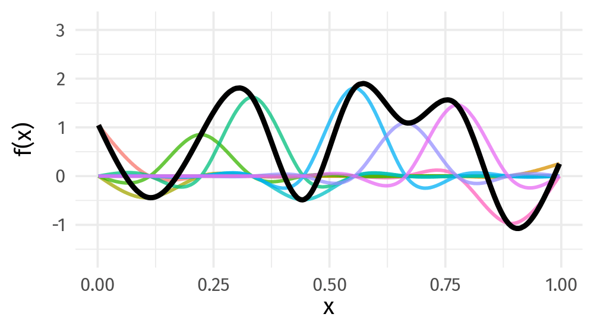]

???

But if we choose different weights we get more wiggly spline

Each of the splines I showed you earlier are all generated from the same basis functions just using different weights

---

# Maximise penalised log-likelihood &#8680; &beta;

```{r basis-functions-anim, results = "hide"}
sm2 <- smoothCon(s(x, k = k, bs = "cr"), data = data, knots = knots)[[1]]$X
beta <- coef(lm(ycent ~ sm2 - 1, data = data))
wtbasis <- sweep(sm2, 2L, beta, FUN = "*")
colnames(wtbasis) <- colnames(sm2) <- paste0("F", seq_len(k))
## create stacked unweighted and weighted basis
basis <- as_tibble(rbind(sm2, wtbasis)) %>%
    add_column(x = rep(data$x, times = 2),
               type = rep(c('unweighted', 'weighted'), each = nrow(sm2)),
               .before = 1L)
##data <- cbind(data, fitted = rowSums(scbasis))
wtbasis <- as_tibble(rbind(sm2, wtbasis)) %>%
    add_column(x      = rep(data$x, times = 2),
               fitted = rowSums(.),
               type   = rep(c('unweighted', 'weighted'), each = nrow(sm2))) %>%
    pivot_longer(-(x:type), names_to = 'bf')
basis <- pivot_longer(basis, -(x:type), names_to = 'bf')

p3 <- ggplot(data, aes(x = x, y = ycent)) +
    geom_point(aes(y = yobs), alpha = 0.2) +
    geom_line(data = basis,
              mapping = aes(x = x, y = value, colour = bf),
              lwd = 1, alpha = 0.5) +
    geom_line(data = wtbasis,
              mapping = aes(x = x, y = fitted), lwd = 1, colour = 'black', alpha = 0.75) +
    guides(colour = FALSE) +
    labs(y = 'f(x)', x = 'x') +
    theme_minimal(base_size = 16, base_family = 'Fira Sans')

crs_fit <- animate(p3 + transition_states(type, transition_length = 4, state_length = 2) + 
                   ease_aes('cubic-in-out'),
                   nframes = 100, height = anim_height, width = anim_width, res = anim_res,
                   dev = anim_dev, units = "px")

anim_save('./resources/gam-crs-animation.gif', crs_fit)
```

.center[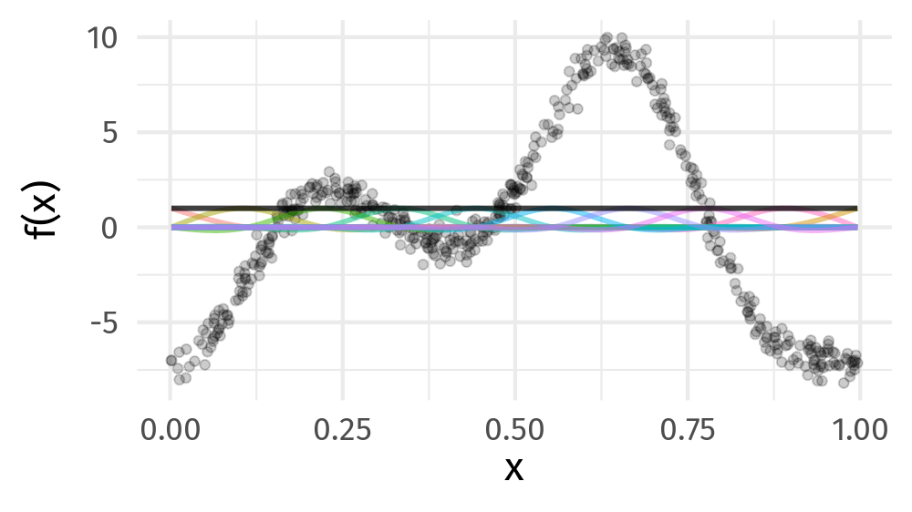]

???

Fitting a GAM involves finding the weights for the basis functions that produce a spline that fits the data best, subject to some constraints

---

# Model

```{r eval=FALSE, echo=TRUE}
pamm(ped_status ~
    s(tend, bs = 'cr', k = 10) +
    s(year, bs = 'cr', k = 10) +
    s(tend, lake, bs = 'fs', k = 10) +
    s(Year, lake, bs = 'fs', k = 10) +
    s(long, lat, bs = 'ds', k = 20) +
    ti(tend, Year, bs = 'cr', k = c(5, 5)) +
    ti(tend, long, lat, bs = c('cr', 'ds'), d = c(1, 2), k = c(5, 5)) +
    ti(Year, long, lat, bs = c('cr', 'ds'), d = c(1, 2), k = c(5, 5)),
  data = freeze.na,
  method = 'fREML', # fast restricted marginal likelihood
  engine = 'bam',   # use mgcv::bam() for faster fitting
  discrete = TRUE)  # discretize the covariates for faster fitting
```

Fit North American and Eurasian lakes in separate models

--

### Want to learn more?

**3-day Phd Course in GAMs, December 10-12<sup>th</sup>, 2024 (TBC) @ AU Viborg**

---

# Results

_Eurasian_ lakes froze 17 days later and thawed 3 days earlier in 2010 than 1950

_North American_ lakes froze 25 days later and thawed 10 days earlier in 2010 than 1950

Most of that change happened post 1995

---

.center[
```{r include-spatial-dates-figure, out.width = "80%"}
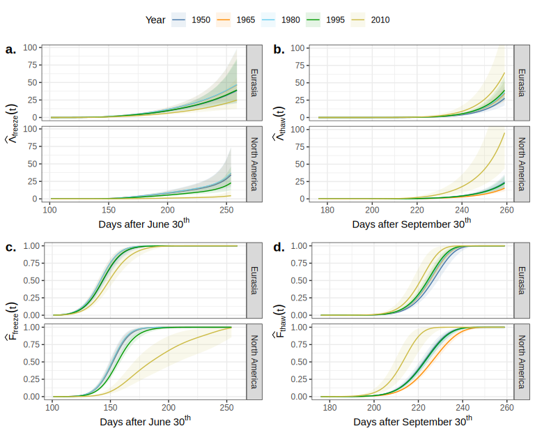
```
]

---

# Change in freeze dates

.row[

.col-12[
```{r include-freeze-figure, out.width = "90%", fig.align = "center"}
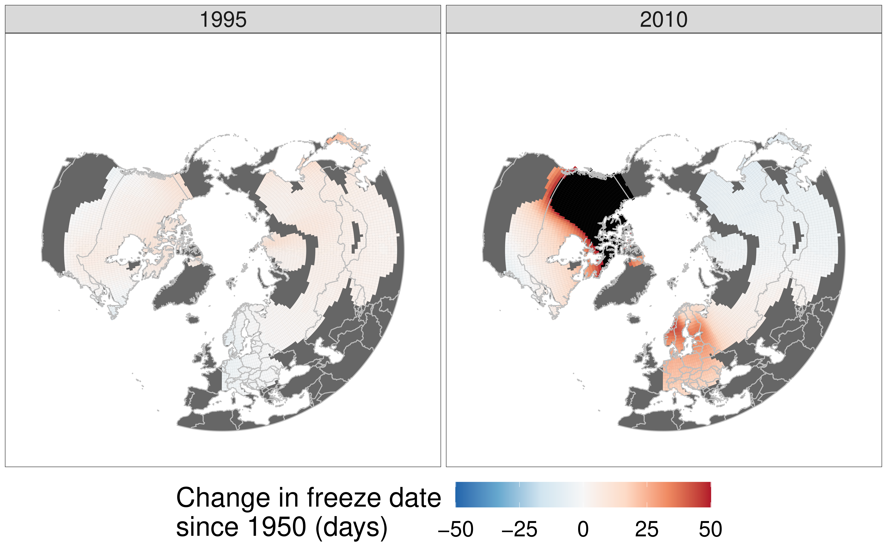
```

]

]

---

# Change in thaw dates

.row[

.col-12[
```{r include-thaw-figure, out.width = "90%", fig.align = "center"}
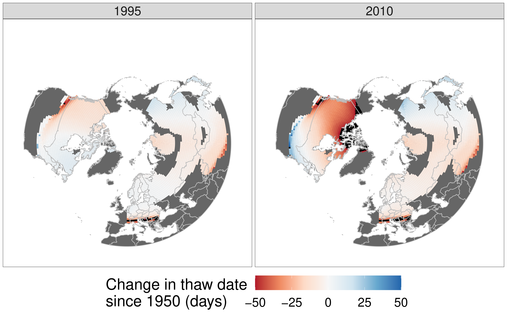
```

]

]

---

# Summary

* Time-to-event models are an appropriate way to model lake ice phenology data

* PAMMs are a flexible way to model data with non-linear trends in freeze/thaw dates

* Avoids *ad hoc* choices regarding change points

* Eurasian lakes froze 17 days later and thawed 3 days earlier (1950 vs 2010)

* North America lakes froze 25 days later and thawed 10 days earlier (1950 vs 2010)

* Most of that change occured after 1995

---

# Future work

* Update our models to the latest database release

* Estimate rates of change using derivatives of smooths

* Extending models to include explanatory factors

    * Using linear functional terms can use smooth of anticedant conditions as predictor of freeze/thawing

---

# Thank you & More 📷

Mail: gavin@anivet.au.dk

[github.com/gavinsimpson/ecos-water-talk-may-2024](https://github.com/gavinsimpson/ecos-water-talk-may-2024)

.center[

```{r, fig.align = "center", out.width="45%"}

```
]

---

# Censoring

.center[
```{r include-three-lake-example-censoring-figure}
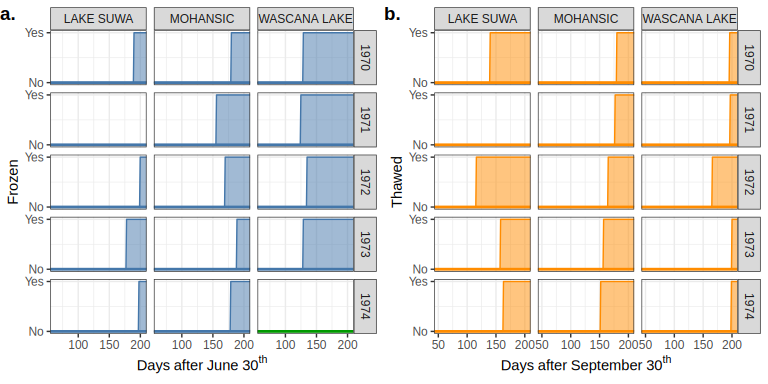
```
]

---

# PAMMs &mdash; Lake Mendota

.center[
```{r include-mendota-freeze-year-tend-figure, out.width = "100%"}
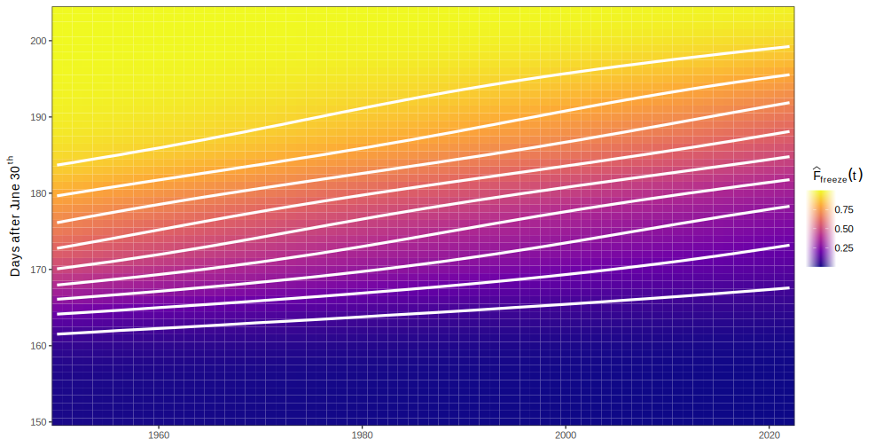
```
]
